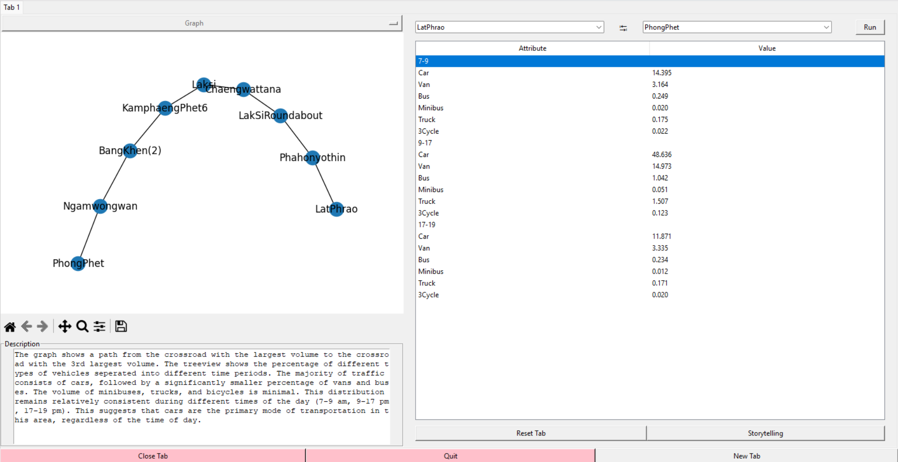
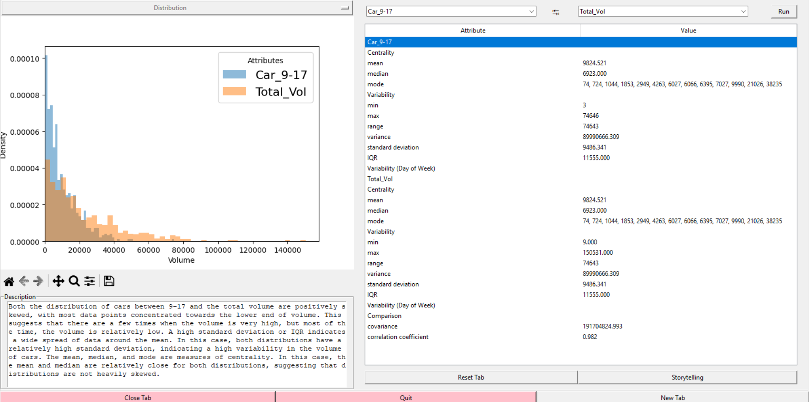
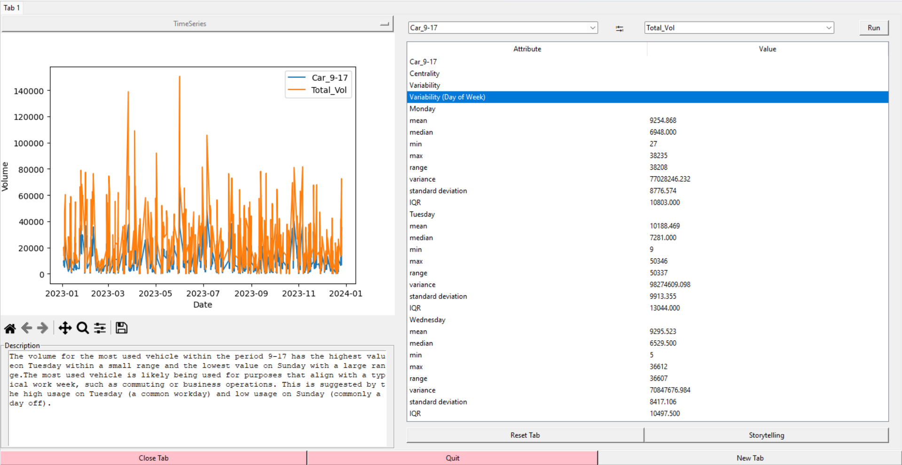

# Analyzing Vehicle Distribution in Bangkok’s Transportation Networks

## Overview
This program, named "Analyzing Vehicle Distribution in Bangkok’s Transportation Networks", provides visualizations based on publicly available data regarding traffic volume across roads and crossroads in Bangkok. Users can choose from various visualization types such as graphs, distributions, and time series. Additionally, the program displays statistics including centrality and variability of the data. Users can create multiple tabs and switch between them to view different visualizations.

## Installation Requirements
To run this program, ensure that you have the required modules specified in `requirements.txt` installed. \
The dataset required for this program is located in `Dataset/all_data.csv`. Ensure that this file is present in the same directory as the program files.

## How to Run
1. Clone or download the repository containing the program files.
2. Navigate to the directory containing the program files.
3. Install the required modules.
4. Ensure that the dataset file `all_data.csv` is present in the `Dataset` directory.
5. Navigate to the directory containing the project files in the terminal/command prompt.
6. Create and activate a virtual environment:
7. Run the `main.py` Python: ``python main.py``

## License
Copyright (c) 2024 Oak Soe Htet

Permission is hereby granted, free of charge, to any person obtaining a copy
of this software and associated documentation files (the "Software"), to deal
in the Software without restriction, including without limitation the rights
to use, copy, modify, merge, publish, distribute, sublicense, and/or sell
copies of the Software, and to permit persons to whom the Software is
furnished to do so, subject to the following conditions:

The above copyright notice and this permission notice shall be included in all
copies or substantial portions of the Software.

THE SOFTWARE IS PROVIDED "AS IS", WITHOUT WARRANTY OF ANY KIND, EXPRESS OR
IMPLIED, INCLUDING BUT NOT LIMITED TO THE WARRANTIES OF MERCHANTABILITY,
FITNESS FOR A PARTICULAR PURPOSE AND NONINFRINGEMENT. IN NO EVENT SHALL THE
AUTHORS OR COPYRIGHT HOLDERS BE LIABLE FOR ANY CLAIM, DAMAGES OR OTHER
LIABILITY, WHETHER IN AN ACTION OF CONTRACT, TORT OR OTHERWISE, ARISING FROM,
OUT OF OR IN CONNECTION WITH THE SOFTWARE OR THE USE OR OTHER DEALINGS IN THE
SOFTWARE.

## References
- Project proposal
- Development Plan
- UML diagrams