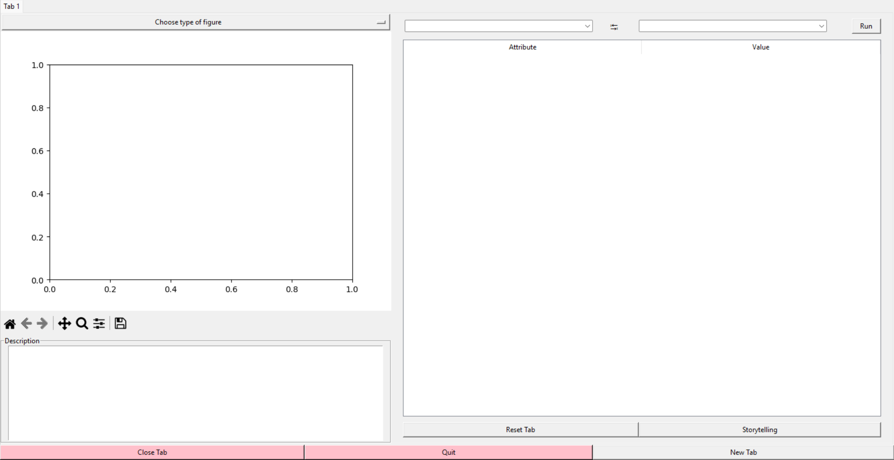

### Running the Interface

Make sure all the required modules specified in the `requirements.txt` file are installed.

#### Starting the Application

1. Navigate to the directory containing the project files in the terminal/command prompt.

2. Create and activate a virtual environment:

3. After installing all required modules have been installed, run the minimally functioning program 
which is the interface.py file in the terminal.
   ```bash
   python interface.py

### Interface Functionality

- After launching the application, you will see a dropdown box from which you can choose a graph type. Currently, Graph, Distribution, and Time series have minimum functionality.
- Two combo boxes located on the top right allow you to select two attributes to be graphed or compared.
- To quit the program, use the "Quit" button located at the bottom of the interface.

